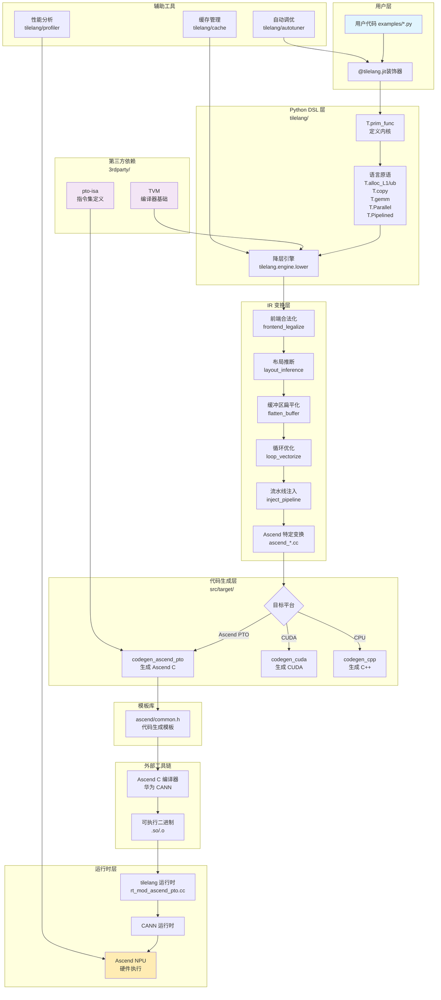

# TileLang-Ascend 项目架构说明

## 项目简介

TileLang-Ascend 是一个专门为华为昇腾（Ascend）NPU（神经网络处理器）架构优化的领域特定语言（DSL）。它基于 tile-lang 的 Python 语法和 [TVM](https://tvm.apache.org/) 编译器基础设施构建，使开发者能够高效地创建高性能 AI 计算内核，包括矩阵乘法（GEMM）、向量运算和注意力机制等操作。

编译器后端支持两条技术路线：[Ascend C & PTO](https://github.com/tile-ai/tilelang-ascend/tree/ascendc_pto) 和 [AscendNPU IR](https://github.com/tile-ai/tilelang-ascend/tree/npuir)。

## 目录结构说明

### 核心目录概览

```
tilelang-ascend/
├── tilelang/          # Python DSL 和编译器前端（用户接口层）
├── src/               # C++ 后端实现（核心编译器）
├── 3rdparty/          # 第三方依赖库
├── examples/          # 示例代码和教程
├── docs/              # 项目文档
├── testing/           # 测试代码
├── benchmark/         # 性能基准测试
└── maint/             # 维护工具和脚本
```

---

## 详细目录功能说明

### 1. `tilelang/` - Python DSL 和编译器前端

这是用户主要交互的接口层，提供了 Python 风格的 DSL 来编写 NPU 内核。

```
tilelang/
├── jit/              # JIT（即时）编译器实现
│   ├── __init__.py   # JIT 装饰器和编译入口
│   ├── kernel.py     # JITKernel 类，封装编译后的内核
│   └── param.py      # 内核参数定义
│
├── language/         # 语言接口和原语
│   ├── tir/          # TIR（Tensor IR）抽象语法树
│   ├── proxy.py      # 张量、缓冲区代理对象
│   ├── kernel.py     # Kernel 上下文管理
│   ├── allocate.py   # 内存分配原语（alloc_L1, alloc_ub等）
│   ├── copy.py       # 数据拷贝原语
│   ├── gemm.py       # GEMM 计算原语
│   ├── parallel.py   # 并行计算原语（T.Parallel）
│   ├── pipeline.py   # 流水线原语（T.Pipelined）
│   ├── ascend.py     # Ascend 特定原语
│   └── ascend_tile.py # Ascend Tile 操作
│
├── engine/           # 编译引擎核心
│   ├── lower.py      # 降层引擎：TIR → 优化后 TIR
│   ├── param.py      # 内核参数管理
│   └── callback.py   # 后处理回调注册
│
├── transform/        # IR 变换 Pass（Python 层）
│   └── 前端优化变换
│
├── autotuner/        # 自动调优器
│   └── 自动搜索最优内核参数
│
├── carver/           # 核心调度器
│   └── 硬件资源映射和调度
│
├── layout/           # 内存布局定义
│   └── Layout, Fragment 类
│
├── primitives/       # 底层计算原语
│   └── gemm/         # GEMM 基础原语
│
├── contrib/          # 扩展功能
│   └── 第三方集成
│
├── utils/            # 工具函数
│   └── 辅助工具和类型定义
│
├── cache/            # 编译缓存管理
├── profiler/         # 性能分析工具
└── __init__.py       # 模块入口，暴露主要 API
```

**关键功能：**
- **JIT 编译**：`@tilelang.jit` 装饰器自动编译 Python 函数为可执行内核
- **DSL 原语**：提供 `T.alloc_L1`, `T.copy`, `T.gemm`, `T.Parallel` 等硬件原语
- **编译引擎**：将 TIR 降层到目标硬件代码
- **自动调优**：搜索最优的内核配置参数

---

### 2. `src/` - C++ 后端实现

C++ 后端实现了核心的编译器 IR 变换、目标代码生成和运行时支持。

```
src/
├── ir.cc                      # IR 结构定义和扩展
│
├── tl_templates/              # 模板库（代码生成模板）
│   ├── ascend/                # Ascend 特定模板
│   │   ├── common.h           # 通用头文件
│   │   └── printf.h           # 调试打印模板
│   ├── cuda/                  # CUDA 代码生成模板
│   ├── hip/                   # HIP/ROCm 代码生成模板
│   ├── cpu/                   # CPU 代码生成模板
│   └── pto/                   # PTO 指令模板
│
├── transform/                 # IR 变换 Pass（C++ 实现）
│   ├── frontend_legalize.cc   # 前端合法化
│   ├── layout_inference.cc    # 布局推断
│   ├── flatten_buffer.cc      # 缓冲区扁平化
│   ├── loop_vectorize.cc      # 循环向量化
│   ├── inject_pipeline.cc     # 流水线注入
│   ├── lower_tile_op.cc       # Tile 操作降层
│   ├── ascend_*.cc            # Ascend 特定变换
│   │   ├── ascend_combinecv.cc           # AIC/AIV 核心合并
│   │   ├── ascend_lower_parallel_to_vector.cc  # Parallel → Vector 降层
│   │   ├── ascend_memory_planning.cc     # 内存规划
│   │   ├── ascend_sync_insert.cc         # 同步指令插入
│   │   └── ascend_host.cc                # Ascend 主机端处理
│   └── ...其他变换
│
├── target/                    # 目标代码生成
│   ├── codegen_ascend.cc      # Ascend C 代码生成器
│   ├── codegen_ascend_pto.cc  # Ascend PTO 代码生成器
│   ├── codegen_cuda.cc        # CUDA 代码生成器
│   ├── codegen_hip.cc         # HIP 代码生成器
│   ├── codegen_cpp.cc         # C++ 代码生成器
│   ├── codegen_webgpu.cc      # WebGPU 代码生成器
│   ├── rt_mod_ascend.cc       # Ascend 运行时模块
│   ├── rt_mod_ascend_pto.cc   # Ascend PTO 运行时模块
│   ├── rt_mod_cuda.cc         # CUDA 运行时模块
│   ├── rt_mod_hip.cc          # HIP 运行时模块
│   ├── rt_mod_cpp.cc          # C++ 运行时模块
│   └── utils.cc               # 目标工具函数
│
├── runtime/                   # 运行时支持（CUDA/Ascend）
│
├── layout/                    # 布局处理（C++）
│
└── op/                        # 操作定义和 lowering
```

**关键功能：**
- **IR 变换**：实现各种编译器优化 Pass
- **代码生成**：将 TIR 转换为目标代码（Ascend C/CPU/CUDA/HIP）
- **运行时**：提供内核执行、内存管理等运行时支持

---

### 3. `3rdparty/` - 第三方依赖

```
3rdparty/
├── tvm/                  # TVM 编译器基础设施（ fork/修改版）
├── pto-isa/              # PTO（Packet Tensor Operator）ISA 定义
├── cutlass/              # NVIDIA CUTLASS 矩阵乘法库
├── composable_kernel/    # AMD Composable Kernel 库
├── catlass/              # CUTLASS 变体
└── shmem/                # 共享内存实现
```

**关键依赖：**
- **TVM**：核心编译器基础设施，提供 IR、调度、代码生成框架
- **pto-isa**：Ascend PTO 指令集架构定义

---

### 4. `examples/` - 示例代码

提供了丰富的算子实现示例，展示了如何使用 TileLang-Ascend 编写高性能内核。

```
examples/
├── gemm/                      # 矩阵乘法示例
│   ├── example_gemm.py        # 基础 GEMM
│   ├── example_gemm_intrinsic.py  # 高性能 GEMM（使用 intrinsic）
│   └── example_gemm_aot.py    # AOT 编译示例
│
├── elementwise/               # 逐元素操作
│   └── vec_add.py             # 向量加法
│
├── flash_attention/           # Flash Attention 实现
│   ├── flash_attn_bhsd.py     # BSHD 布局 Flash Attention
│   ├── flash_attn_bshd_developer.py  # Developer 模式
│   └── flash_attn_bshd_pipeline.py   # 流水线优化版本
│
├── sparse_flash_attention/    # 稀疏 Flash Attention
│
├── lightning_indexer/         # Lightning 索引器
│
├── pipeline/                  # 流水线示例
│   ├── matmul_add_pipeline.py
│   └── flash_attn_bshd_pipeline.py
│
├── softmax/                   # Softmax 算子
├── reduce/                    # 归约算子
├── activation/                # 激活函数
├── normalization/             # 归一化层
├── convolution/               # 卷积算子
├── grouped_gemm/              # 分组 GEMM
├── gemv/                      # 矩阵-向量乘法
├── quant_batch_matmul/        # 量化批量矩阵乘法
├── autotune/                  # 自动调优示例
├── developer_mode/            # Developer 模式示例
├── print/                     # 调试工具示例（T.printf, T.dump_tensor）
└── torch_tl_ascend/           # PyTorch 集成示例
```

---

### 5. `docs/` - 项目文档

```
docs/
├── index.md                   # 文档首页
├── get_started/               # 入门指南
│   ├── Installation.md        # 安装说明
│   └── overview.md            # 项目概览
│
├── tutorials/                 # 教程
│   ├── writing_kernels_with_tilelibrary.md
│   ├── writing_kernels_with_thread_primitives.md
│   ├── annotate_memory_layout.md
│   ├── debug_tools_for_tilelang.md
│   ├── auto_tuning.md
│   ├── jit_compilation.md
│   ├── pipelining_computations_and_data_movements.md
│   ├── t_parallel.md          # T.Parallel 教程
│   ├── t_pipelied.md          # T.Pipelined 教程
│   └── automatic_workspace_allocation.md
│
├── deeplearning_operators/    # 深度学习算子文档
│   ├── elementwise.md
│   ├── gemv.md
│   ├── matmul.md
│   ├── matmul_dequant.md
│   ├── flash_attention.md
│   ├── flash_linear_attention.md
│   ├── deepseek_mla.md
│   ├── convolution.md
│   └── tmac_gpu.md
│
├── language_ref/              # 语言参考
│   ├── ast.md                 # AST 文档
│   ├── primitives.md          # 原语参考
│   └── tilelibrary.md         # Tile 库参考
│
└── api/                       # API 参考
    └── modules.md
```

---

### 6. `testing/` - 测试代码

```
testing/
├── python/                    # Python 单元测试
│   └── test_*.py
└── cpp/                       # C++ 单元测试
```

---

### 7. `benchmark/` - 性能基准测试

```
benchmark/
└── 性能测试脚本
```

---

### 8. 其他重要文件

```
├── setup.py                   # Python 包安装脚本
├── CMakeLists.txt             # C++ 构建配置
├── install_ascend.sh          # Ascend 平台安装脚本
├── set_env.sh                 # 环境变量设置脚本
├── requirements*.txt          # Python 依赖
├── pyproject.toml             # Python 项目配置
├── VERSION                    # 版本号
├── LICENSE                    # MIT 许可证
└── README.md                  # 英文 README
```

---

## 各目录之间的协同关系

### 编译流程协同

```
┌─────────────────────────────────────────────────────────────────┐
│                         用户代码层                              │
│  (examples/ - 用户编写 Python DSL 代码)                        │
└─────────────────────────────┬───────────────────────────────────┘
                              │
                              ▼
┌─────────────────────────────────────────────────────────────────┐
│                    Python DSL 层                               │
│  (tilelang/)                                                  │
│  ├─ @tilelang.jit 装饰器     →  JIT 编译入口                 │
│  ├─ T.prim_func             →  定义 TIR 函数                  │
│  ├─ T.alloc_L1/ub           →  内存分配                       │
│  ├─ T.copy/T.gemm           →  计算原语                       │
│  ├─ T.Parallel/T.Pipelined  →  并行/流水线                   │
│  └─ tilelang.engine.lower   →  降层引擎                       │
└─────────────────────────────┬───────────────────────────────────┘
                              │ TIR (Tensor IR)
                              ▼
┌─────────────────────────────────────────────────────────────────┐
│                     变换 Pass 层                               │
│  (src/transform/ + tilelang/transform/)                       │
│  ├─ frontend_legalize      →  前端合法化                      │
│  ├─ layout_inference       →  布局推断                        │
│  ├─ flatten_buffer         →  缓冲区扁平化                    │
│  ├─ loop_vectorize         →  循环向量化                      │
│  ├─ inject_pipeline        →  流水线注入                      │
│  ├─ ascend_*               →  Ascend 特定变换                 │
│  │  ├─ ascend_lower_parallel_to_vector  →  Parallel→Vector   │
│  │  ├─ ascend_memory_planning          →  内存规划          │
│  │  ├─ ascend_sync_insert              →  同步插入          │
│  │  └─ ascend_combinecv                →  核心合并          │
│  └─ lower_tile_op          →  Tile 操作降层                  │
└─────────────────────────────┬───────────────────────────────────┘
                              │ 优化后的 TIR
                              ▼
┌─────────────────────────────────────────────────────────────────┐
│                    代码生成层                                   │
│  (src/target/)                                                │
│  ├─ codegen_ascend_pto.cc  →  生成 Ascend C + PTO 指令       │
│  ├─ rt_mod_ascend_pto.cc   →  Ascend PTO 运行时模块          │
│  ├─ codegen_cuda.cc        →  生成 CUDA 代码（兼容性）       │
│  └─ rt_mod_*.cc            →  运行时模块                      │
└─────────────────────────────┬───────────────────────────────────┘
                              │ Ascend C 源码
                              ▼
┌─────────────────────────────────────────────────────────────────┐
│                    模板库层                                    │
│  (src/tl_templates/)                                          │
│  └─ ascend/common.h, printf.h →  代码生成模板                │
└─────────────────────────────┬───────────────────────────────────┘
                              │
                              ▼
┌─────────────────────────────────────────────────────────────────┐
│                   外部编译器                                    │
│  (华为 CANN 工具链)                                            │
│  ├─ Ascend C 编译器          →  编译 Ascend C 代码           │
│  └─ PTO 汇编器               →  处理 PTO 指令                │
└─────────────────────────────┬───────────────────────────────────┘
                              │
                              ▼
┌─────────────────────────────────────────────────────────────────┐
│                    可执行二进制                                 │
│  (.so 或 .o 文件)                                             │
└─────────────────────────────┬───────────────────────────────────┘
                              │
                              ▼
┌─────────────────────────────────────────────────────────────────┐
│                   运行时执行                                   │
│  (tilelang 运行时 + CANN 运行时)                               │
│  └─ 在 Ascend NPU 上执行                                      │
└─────────────────────────────────────────────────────────────────┘
```

---

## 整体架构图



---

## 模块间数据流

### 1. 用户编写内核
用户在 `examples/` 中使用 Python DSL 编写内核函数，使用 `@tilelang.jit` 装饰器标记。

### 2. JIT 编译触发
调用被装饰的函数时，JIT 编译器启动：
- `tilelang/jit/` 解析函数参数
- `tilelang/language/` 构建 TIR（Tensor IR）

### 3. IR 降层和优化
`tilelang/engine/lower.py` 启动降层流程，依次应用 `src/transform/` 中的各种 Pass：
- **前端合法化**：规范化 IR 结构
- **布局推断**：推断最优内存布局
- **循环优化**：向量化、流水线化
- **Ascend 特定变换**：Parallel → Vector 降层、内存规划、同步插入

### 4. 代码生成
`src/target/codegen_ascend_pto.cc` 将优化后的 TIR 转换为 Ascend C 代码，使用 `src/tl_templates/` 中的模板。

### 5. 外部编译
华为 CANN 工具链将生成的 Ascend C 代码编译为可执行的机器码。

### 6. 运行时执行
`tilelang` 运行时加载并执行编译好的内核，通过 CANN 运行时与 Ascend NPU 交互。

---

## 核心技术特性

### 1. 双技术路线支持
- **Ascend C & PTO**：使用 Ascend C 语言和 PTO（Packet Tensor Operator）指令
- **AscendNPU IR**：使用 NPU IR 表示

### 2. Pythonic DSL
- Python 原生语法
- 装饰器模式（`@tilelang.jit`）
- 类型提示支持

### 3. 硬件原语映射
- `alloc_L1` → L1 缓冲区（Cube 核心）
- `alloc_ub` → Unified Buffer（Vector 核心）
- `alloc_L0A/L0B/L0C` → L0 寄存器
- `T.gemm` / `T.mma` → 矩阵乘法加速器
- `T.Parallel` → 向量化指令
- `T.Pipelined` → 流水线调度

### 4. 编译器优化
- **自动同步插入**：`TL_ASCEND_AUTO_SYNC`
- **自动内存规划**：`TL_ASCEND_MEMORY_PLANNING`
- **自动核间同步**：`TL_ASCEND_AUTO_CV_SYNC`
- **流水线优化**：计算与数据传输重叠

### 5. 高级特性
- **自动工作空间分配**：`workspace_idx` 参数
- **调试工具**：`T.printf`, `T.dump_tensor`
- **布局注解**：`T.annotate_layout`
- **地址注解**：`T.annotate_address`

---
